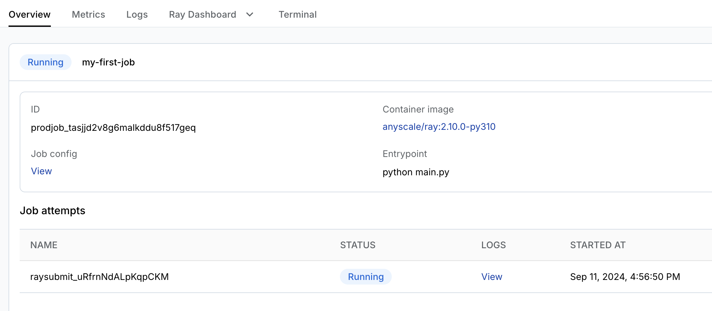

# Introduction to Anyscale Jobs

**⏱️ Time to complete**: 5 min

This tutorial shows you how to:

1. Submit Anyscale Jobs
2. View and monitor Anyscale Jobs in Anyscale UI.

## When to use Anyscale Jobs

We recommend running batch Ray apps as Anyscale Jobs if the following features are needed: 
- Automated failure handling and retries
- Alerting
- Programmatic submission API & CI/CD integration
- Cron jobs
- Job queue and priority-based scheduling
- Record and persist outputs such as logs


**Note**: In open source Ray, users run batch Ray apps with "Ray Jobs". Anyscale Jobs launch Ray Jobs on standalone Ray Clusters and manage the lifecycle of them. It also provides the additional features listed above. No code change to your Ray script is needed when running your existing Ray Jobs as Anyscale Jobs.
## Submit an Anyscale Job and monitor with job UI

You can submit jobs from any machines, using the Anyscale CLI or SDK. In this tutorial, we use Anyscale CLI as an example. 
### Step 1: install Anycale CLI and authenticate
```bash
# Install Anyscale CLI
$ pip install -U anyscale
# Authenticate
$ anyscale login
```

### Step 2: Submit an Anyscale Job
This example includes a simple processing job that runs a few [Ray tasks](https://docs.ray.io/en/latest/ray-core/key-concepts.html#tasks). Run the following command to submit it as an Anyscale Job

```bash
$ anyscale job submit --wait -f job.yaml
```
This example includes two important files <br>
- job.yaml: define the entrypoint and configs of your job. Learn more about the [supported fields](https://docs.anyscale.com/reference/job-api#jobconfig). <br>
- job.py: the actual Ray script to run

 It's also possible to submit your Ray script directly without using YAML files. However, YAML files are recommended when dealing with jobs with more complicated configs. For more details, check out the [Anyscale Job reference](https://docs.anyscale.com/reference/job-api).


### Step 3: Monitor with job UI

The output from the submission command above should print the URL to your job in Anyscale UI. You can view the job state, logs, metrics, and Ray Dashboard in the UI.




## (Optional) Transition from Anyscale Workspaces to Anyscale Jobs
[Anyscale Workspace](https://docs.anyscale.com/platform/workspaces/) provides a development environment that's powered by an autoscaling Ray Cluster.

Users can interactively iterate on the dependencies and Ray apps insdie workspaces. This is great for fast iteration but it lacks features like retries, alerting, etc.

When you are ready to move your apps into production or need certain features provided by Anyscale Jobs. You can submit an Anyscale Job easily from your Workspace, which will start a separate cluster and run your Ray app.

```bash
# By default, Jobs submitted from workspaces inherit the dependencies (conatiner image and runtime dependencies) and compute config of the workspace. 
# You also don't need to specify required files via --working-dir. The workspace directory is used automatically.
$ anyscale job submit --name my-job --wait -- python main.py
```
Tip: although it's convenient to submit Ray sciprt directly, you may still want to use YAML files in CLI so that it's reproducible outside workspaces.


## Summary

This tutorial shows your how to:
1. Submit Anyscale Jobs
2. View and monitor Anyscale Jobs in Anyscale UI.

Check out [Anyscale Jobs documentation](https://docs.anyscale.com/platform/jobs/) for more details